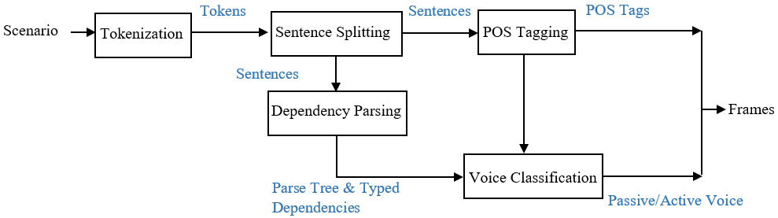
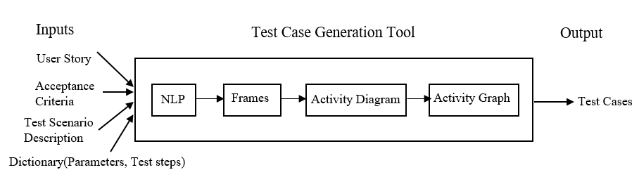

# **Motivation**
Test case generation covers 40-70% of the software test life cycle. Current practices involve manually writing the test cases based on the functional requirements provided.

To save manual effort the proposed work tries to investigate the possibility of an auto-generation of test cases using natural language processing. Auto-generated tests will also facilitate easier maintenance and reuse of test cases if the customer changes the requirements.

**High level Design of model**

1. The input is in the form of a user story and test scenario description.
1. The natural language parser performs sentence splitting, _***part-of-speech tagging***_, and _***syntactic parsing***_ to identify the relationship between the words.
1. Using the dependencies derived we convert them into _***frames***_ which is intermediary structured representations while transforming user requirements into _***UML activity diagram***_.
1. From the activity diagram, we create the _***activity graph***_ consisting of all the activities represented as nodes.
1. Traversal of all possible valid paths using the Depth First Search algorithm/Breadth First Search algorithm.

  
# **Software build**
1. Step 1: Get sources from GitHub$ git clone https://github.com/scm/crtx/qa-intern-project-test.git
2. Download external jar dependencies in the project buildpath.
2. mvn clean install.

### Resolve dependencies for MacOS:
1. Download WordNet-3.0\
2. cd Downloads/WordNet-3.0\
3. Locate 'Tcl.framework' and 'Tk.framework/' modify paths if needed and run the command below to compile WordNet with appropriate paths for 'Tcl.framework' and 'Tk.framework'.

WordNet-3.0 % sudo ./configure --with-tclconfig=/Library/Developer/CommandLineTools/SDKs/MacOSX11.1.sdk/System/Library/Frameworks/Tcl.framework --with-tkconfig=/Library/Developer/CommandLineTools/SDKs/MacOSX10.15.sdk/System/Library/Frameworks/Tk.framework/

**Expected Output:**

WordNet is now configured

  Installation directory:               /usr/local/WordNet-3.0

  To build and install WordNet:

    make
    make install

  To run, environment variables should be set as follows:

    PATH - include ${exec_prefix}/bin
    WNHOME - if not using default installation location, set to /usr/local/WordNet-3.0

    See INSTALL file for details and additional environment variables
    which may need to be set on your system.

4. Next run:-
WordNet-3.0 % make

5. Next run:-
WordNet-3.0 % make install

### **Pre-requisites:**
1. Install Java and add environment variable. export JAVA_HOME="/usr/libexec/java_home">> ~/.bash_profile
 
2. Install maven and add environment variable. export PATH="$PATH:/Users/$username/Documents/apache-maven-3.8.3/bin"

# **Use cases and benefits**
1. Clients were interested in the possibility of capturing design requirements in a behavioral model that could potentially reduce rework due to miscommunication between the product owner and developer/tester.
2. The test cases must be able to provide maximum coverage of paths and data.
3. Not all the testers have prior knowledge of the working of the system which leads to difficulties in designing the test cases to match the product owner’s needs.
4. Autogeneration of test cases will help save time and money, improve the quality of testing and ensure better test coverage.
5. Autogenerated tests will also facilitate easier maintenance and reuse of test cases if the customer changes the requirements.

